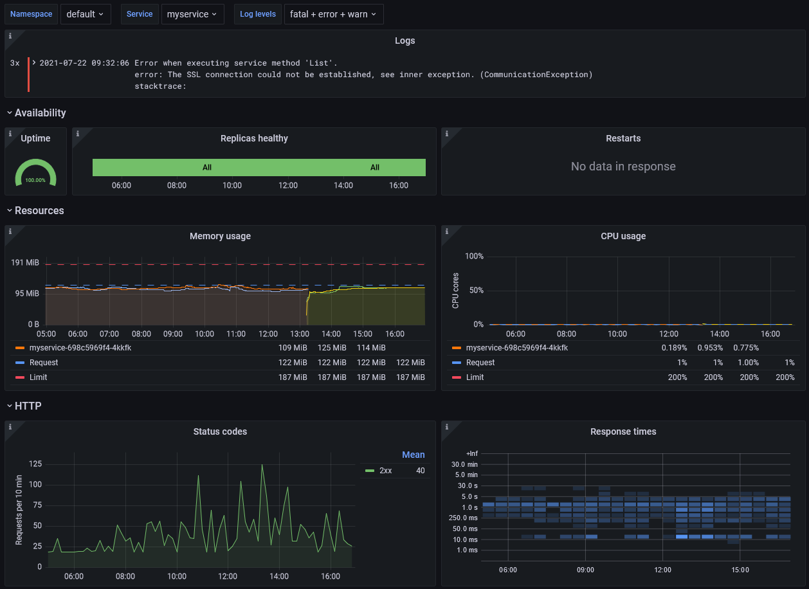

# Generic Service Dashboard

This Grafana dashboard simplifies monitoring typical "80% case" services on Kubernetes. It shows:

- [Logs](#logs)
- [Availability and Resources](#availability-and-resources)
- [HTTP and gRPC traffic](#traffic)



## Logs

The dashboard assumes you are using [Loki](https://grafana.com/oss/loki/) to aggregate container log files.

In order for log level filtering to work, you'll need to ensure log entries carry the label `level`.  
Supported values: `trace`, `debug`, `info`, `warn`, `error`, `fatal`

A typical [Promtail configuration](https://grafana.com/docs/loki/latest/clients/promtail/configuration/#pipeline_stages) to achieve this for JSON-encoded log output could look like this:

```yaml
pipelineStages:
  - docker: {}
  - cri: {}
  - json:
      expressions:
        ts: ts
        msg: msg
        level: level
  - timestamp:
      source: ts
      format: RFC3339Nano
      action_on_failure: skip
  - labels:
      level:
  - output:
      source: msg
```

## Availability and Resources

The dashboard works well with services deployed using the [Generic Service Helm Chart](https://artifacthub.io/packages/helm/nano-byte/generic-service). You can also it with other services, as long as they use Kubernetes `Deployment`s and containers with matching names.

The dashboard shows the average uptime of your service, a timeline when some or all replicas where down and a timeline when pod restarts occurred.

It also shows the containers' memory and CPU usage, along with requests and limits if they are specified.

## Traffic

The dashboard assumes you are using [NGINX Ingress Controller](https://kubernetes.github.io/ingress-nginx/) or [Istio](https://istio.io/) to route HTTP traffic to your containers. In order for traffic to be visualized you need to use `Ingress`es or `VirtualService`s with names matching your `Deployment`s.

If you use gRPC and want more detailed information to show up on the dashboard you can provide the necessary metrics by using one of these libraries:

- [go-grpc-prometheus](https://github.com/grpc-ecosystem/go-grpc-prometheus) for Go
- [Nexogen.Libraries.Metrics.Grpc](https://github.com/nexogen-international/Nexogen.Libraries.Metrics#grpc) for .NET
